<p align="center">
  
</p>

<p align="center">
  
</p>

<h1 align="center">
  <span style="background: linear-gradient(135deg, #A855F7 0%, #C026D3 50%, #F472B6 100%); -webkit-background-clip: text; -webkit-text-fill-color: transparent; background-clip: text;">
    Lyndon Bautista
  </span>
</h1>

<p align="center">
  
</p>

<p align="center">
  <i>2nd Year IT Student • Manila, Philippines • Design-minded developer building useful software</i>
</p>

<p align="center">
  <a href="https://github.com/lyndon18-star">
    
  </a>
  <a href="https://www.linkedin.com/in/lyndon-bautista-3a8b2b254/">
    
  </a>
  <a href="mailto:lyndon.bautista@student.com">
    
  </a>
</p>

<p align="center">
  
  
  
</p>

<p align="center">
  
</p>

---

## 👋 About Me

<p align="center">
  
</p>

I build products that feel clean, useful, and memorable. I enjoy frontend engineering, interface design, and turning ideas into thoughtful digital experiences that people actually enjoy using.

```ts
interface Developer {
  name: string;
  role: string;
  location: string;
  passions: string[];
  learning: string[];
  philosophy: string;
}

const me: Developer = {
  name: "Lyndon Bautista",
  role: "2nd Year IT Student",
  location: "Manila, Philippines 🇵🇭",
  passions: [
    "Creative web development",
    "Developer experience",
    "Productive tooling",
    "Design-driven engineering"
  ],
  learning: [
    "Advanced TypeScript",
    "Rust systems programming",
    "Cloud architecture",
    "Developer tooling"
  ],
  philosophy: "Code should be useful, expressive, and a little bit magical."
};
```

<table>
  <tr>
    <td width="33%" valign="top">
      <h3>🎯 Focus</h3>
      <ul>
        <li>Frontend architecture</li>
        <li>UI/UX polish</li>
        <li>Productive workflows</li>
      </ul>
    </td>
    <td width="33%" valign="top">
      <h3>⚡ Building</h3>
      <ul>
        <li>Modern web apps</li>
        <li>Developer tools</li>
        <li>Creative portfolio pieces</li>
      </ul>
    </td>
    <td width="33%" valign="top">
      <h3>💡 Values</h3>
      <ul>
        <li>Readable code</li>
        <li>Clean design</li>
        <li>Continuous learning</li>
      </ul>
    </td>
  </tr>
</table>

<p align="center">
  
</p>

---

## 📊 GitHub Analytics

<p align="center">
  
</p>

<p align="center">
  <a href="https://github.com/lyndon18-star?tab=repositories">
    
  </a>
  <a href="https://github.com/lyndon18-star?tab=stars">
    
  </a>
</p>

<p align="center">
  
</p>

---

## 🎯 Skills

<p align="center">
  
</p>

<p align="center">
  
</p>

<p align="center">
  
</p>

<p align="center">
  
</p>

---

## 🚀 Featured Projects

| Project | Description | Tech Stack | Status |
|---------|-------------|------------|--------|
| **Purple Portfolio** | Personal portfolio with animated purple theme, particle systems, and smooth transitions | Next.js, TypeScript, Framer Motion, Tailwind | 🟢 Active |
| **CodeCat CLI** | Developer productivity tool with purple-themed terminal UI and plugin system | Rust, Clap, Tokio, Crossterm | 🟡 WIP |
| **Violet UI Kit** | Accessible component library with purple design tokens and dark mode first | React, TypeScript, Storybook, Tailwind | 🟢 Active |
| **Particle Playground** | Interactive canvas particle system with violet color presets and motion-rich scenes | TypeScript, Canvas API, WebGL | 🟢 Active |
| **DevTools Purple** | VS Code extension with productivity snippets, themes, and workflow shortcuts | TypeScript, VS Code API, Webpack | 🟡 WIP |

<p align="center">
  <a href="https://github.com/lyndon18-star?tab=repositories">
    
  </a>
</p>

<p align="center">
  
</p>

---

## 💻 Live Coding Session

<p align="center">
  
</p>

<p align="center">
  
</p>

---

## 📈 Contribution Activity

<p align="center">
  <a href="https://github.com/lyndon18-star?tab=overview&from=2025-01-01&to=2025-12-31">
    
  </a>
</p>

<p align="center">
  
</p>

---

## 🌍 Visitor Map

<p align="center">
  
</p>

<p align="center">
  
</p>

---

## 🤝 Connect

<p align="center">
  
</p>

<p align="center">
  <a href="https://github.com/lyndon18-star">
    
  </a>
  <a href="https://www.linkedin.com/in/lyndon-bautista-3a8b2b254/">
    
  </a>
  <a href="mailto:lyndon.bautista@student.com">
    
  </a>
</p>

<p align="center">
  <i>Let’s build something meaningful together.</i>
</p>

<p align="center">
  
</p>
