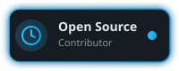

  <!-- Header Accent - Dual Circuit Lines with Pulse Rings -->
  
    

  <!-- Profile Header -->
  
    

  <!-- Typing Animation Header -->
  
    

  <!-- Identity Badges -->
  
  
  
  
    

  <!-- Social Proof -->
  
  
  
  

 

<!-- Tech Wave Divider - 3-Layer Animated Waves -->

  

 

## 🎯 I Build Practical Software

  <table>
    <tr>
      <td align="center" width="33%">
        
         Modern, responsive, accessible
      </td>
      <td align="center" width="33%">
        
         Reliable, scalable, maintainable
      </td>
      <td align="center" width="33%">
        
         Save time, reduce errors
      </td>
    </tr>
  </table>

  <strong>Clean interfaces. Reliable backends. Tools people actually use.</strong> 
  I'm a 2nd-year IT student from Manila who enjoys turning messy problems into working software. 
  Currently shipping projects across web, desktop, and automation — with live demos you can try.

 

<!-- Status Panel -->

  <table>
    <tr>
      <td align="center" style="padding: 0 20px;">
        
         <strong>Portfolio Website</strong> — Next.js + Tailwind + MDX
      </td>
      <td align="center" style="padding: 0 20px;">
        
         <strong>Product Decisions</strong> · <strong>Reliable Backends</strong> · <strong>System Design</strong>
      </td>
      <td align="center" style="padding: 0 20px;">
        
         <strong>Internship</strong> · <strong>Freelance</strong> · <strong>Open Source</strong>
      </td>
    </tr>
  </table>

 

<!-- Animated Stats Counters -->

  

 

<!-- Section Divider with Pulse -->

  

 

## 💡 How I Build

| # | Principle | What It Means in Practice |
|---|-----------|---------------------------|
| **1** | **Find the expensive friction** | Talk to users, spot the manual work that burns time, automate that first |
| **2** | **Ship the smallest useful version** | One working feature > ten planned ones; iterate from real feedback |
| **3** | **Design for the real environment** | Mobile-first, offline-aware, graceful degradation — not happy-path only |
| **4** | **Leave it understandable** | Clear naming, documented decisions, tests that explain the *why* |

 

<!-- Section Divider with Pulse -->

  

 

## 🚀 Featured Projects

  <em>Real projects with live demos — click through to try them</em>

 

### 1. 🎨 Portfolio Website — *In Progress*
**My personal portfolio built with Next.js 14, Tailwind CSS, and MDX for blog/posts.**

  
  
  
  
  
  

 

### 2. ❤️ Parakay Lalove — *JavaScript Project*
**A heartfelt project — details in the repo.**

  
  

 

### 3. 🎭 IIYAK — *JavaScript Project*
**Interactive web application — explore the repo for details.**

  
  

 

### 4. 🏛️ MUSEUM — *JavaScript Project*
**Museum-themed web experience — check the source.**

  
  

 

### 5. ⚙️ SYSTEM-20 — *Java Desktop Application* ⭐
**System 20 — A Java desktop application (1 star).**

  
  
  

 

### 6. 🌐 Labuweb — *HTML/CSS Website*
**Personal web project — HTML-based.**

  
  
  

 

### 7. 🚪 GATHERGATE — *Project*
**Project with the tagline "BASTA" — explore to learn more.**

  

 

### 8. 🔧 Portfolio Backend — *Backend API*
**Backend for portfolio — API layer.**

  

 

  

 

<!-- Wave Divider -->

  

 

## 🧰 Toolbox

### Frontend & Mobile

  

### Backend & APIs

  

### Desktop & DevOps

 

<!-- Floating Badge -->

  

 

---

## 📊 GitHub Analytics

  <!-- Stats Card -->
  
    

  <!-- Streak Stats -->
  
    

  <!-- Top Languages -->
  

 

<!-- Skill Radar Chart -->

  

 

<!-- Code Animation -->

  

 

<!-- Contribution Snake Animation -->

  
    

<!-- Trophies -->

  

 

---

## 📈 Activity Overview

  <!-- WakaTime (if available) -->
  
    

  <!-- Profile Views -->
  
    

  <!-- Visitor Map -->
  

 

<!-- Particles Background -->

  

 

---

## 📬 Let's Connect

<table>
  <tr>
    <td align="center" width="20%">
      
    </td>
    <td align="center" width="20%">
      
    </td>
    <td align="center" width="20%">
      
    </td>
    <td align="center" width="20%">
      
    </td>
    <td align="center" width="20%">
      
    </td>
  </tr>
</table>

 

<!-- Primary CTAs -->

 

---

  
    Built with 💙 by <strong>lyndon18-star</strong> ·
    Inspired by <a href="https://github.com/mightbechr1s" target="_blank">@mightbechr1s</a> ·
    <a href="https://github.com/lyndon18-star/lyndon18-star" target="_blank">View Source</a>
  
    
  

<!-- Custom Assets Reference (for maintenance) -->
<!-- 
  Assets stored in ./assets/:
  - mascot.svg — Code Cat mascot with circuit tail
  - divider-wave.svg — Animated wave section divider
  - section-divider.svg — Minimal line divider with pulse
  - header-accent.svg — Dual circuit lines with pulse rings
  - particles-bg.svg — Floating geometric particles + animated code brackets
  - skill-radar.svg — Animated radar chart with 8 axes
  - code-animation.svg — Typing code animation in terminal
  - stats-counters.svg — 4 animated counter cards with circuit connections
  - floating-badge.svg — Pulsing open source contributor badge
  - tech-wave.svg — 3-layer animated waves with floating tech labels
  See assets/README.md for usage guide
-->